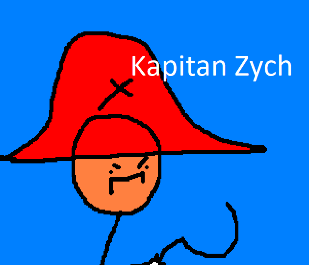

# Kapitan Zych the game

## Description
A simple shooter build on Phaser.js 3.
The game preview is available on [itch.io](https://rkrawczyk.itch.io/kapitan-zych-touhou-20?secret=xcmhiNOxv4H72R0oVBKVlMxC73Q)

## Requirements

[Node.js](https://nodejs.org) is required to install dependencies and run scripts via `npm`.

## Available Commands
Running it locally:

| Command | Description |
|---------|-------------|
| `npm install` | Install project dependencies |
| `npm start` | Build project and open web server running project |
| `npm run build` | Builds code bundle with production settings (minification, uglification, etc..) |
